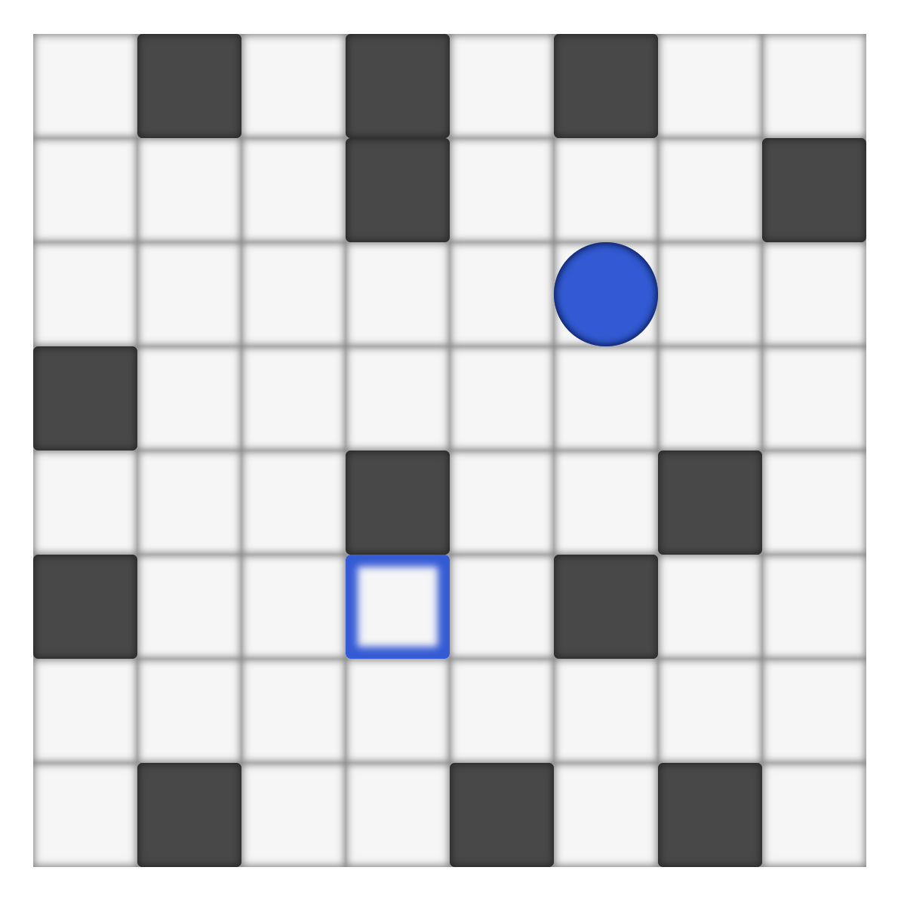

# react-super-slide-me
"Super Slide Me" puzzle game as React component



###How to use

In order to embed the full game onto your site simply add `<SuperSlideMe />` component in the desired place in code.

You can customise the game to your liking using props.

`<SuperSlideMe />` accepts props:

<table>
    <tr>
        <td>id</td>
        <td>Mostly optional id. It is passed to the game component. Can be used to find the game in the DOM, for css styles etc.

It is required only if you embed two games, with the same level config at once.
</td>
    </tr>
    <tr>
        <td>width</td>
        <td>Component's width (in pixels) - if you don't provide this prop component will use its parent's width</td>
    </tr>
    <tr>
        <td>onLastLevelReached</td>
        <td>Callback function fired when player finishes the game. (Last level is just an end screen.)</td>
    </tr>
    <tr>
        <td>levelConfig</td>
        <td>Level configuration object (see below)</td>
    </tr>
    <tr>
        <td>customLevels</td>
        <td>Custom levels array (see below)</td>
    </tr>
</table>

### Level Config

levelConfig prop accepts object in form:

{\
&nbsp;&nbsp;levelSets: string[]\
&nbsp;&nbsp;levelFilter: string\
}

All the levels in game are divided into sets: "A", "B", "C", "D", "E", "F", "X".
Each set has 16 levels and introduces new mechanic. You can specify which sets should your game use by declaring them in an array. By Default all sets are used.

levelFilter can have one of the following values: 

`all` - all levels are used

`onlyEasy` - only first 8 levels of each set are used

`onlyHard` - only last 8 levels of each set are used

`short` - only 1st, 2nd, 9th and 10th levels of each set are used (it's a shorter version of the full game)

`onlyCustom` - none of the levels from any sets are used.


### Custom Levels

You can create your own levels and provide them in `customLevels` props. This prop requires an array of strings. Each string should represent a level.

Example string level representation:

```
'x..x.bx' +
'.xbx.x.' +
'.......' +
'x..e...' +
's.g.g..' +
'x......' +
'.x.x.x.'
```

Each character represents one block/field. Level needs to be square.

Available characters:

<table>
<tr><td>.</td><td>empty field</td></tr>
<tr><td>x</td><td>wall</td></tr>
<tr><td>s</td><td>blue start</td></tr>
<tr><td>S</td><td>pink start</td></tr>
<tr><td>e</td><td>blue end</td></tr>
<tr><td>E</td><td>pink end</td></tr>
<tr><td>b</td><td>moving box</td></tr>
<tr><td>g</td><td>green field</td></tr>
<tr><td>r</td><td>red field</td></tr>
<tr><td>o</td><td>orange wall</td></tr>
<tr><td>c</td><td>orange crushing ball</td></tr>
<tr><td>B</td><td>blue moving box</td></tr>
<tr><td>p</td><td>blue empty field</td></tr>


</table>
